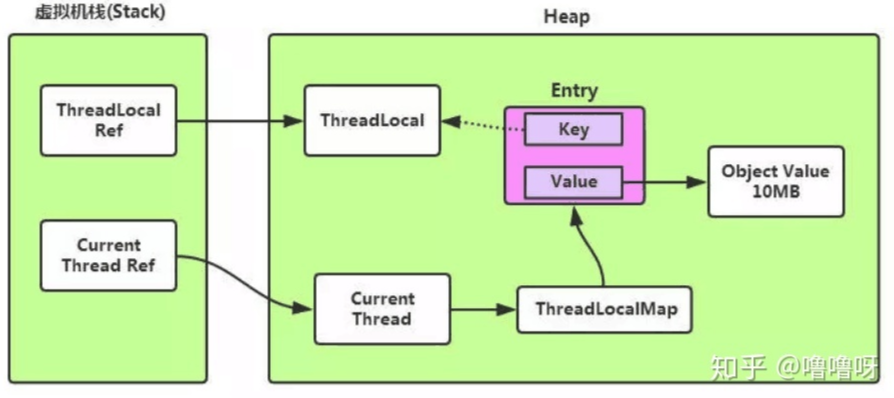

## ThreadLocal在预防内存泄漏方面，做了哪些努力？

Thread中维护了ThreadLocalMap，所以ThreadLocalMap的生命周期和Thread（当前线程）一样长。使用不当就可能会导致内存泄漏问题。但是，在ThreadLocal中，进行get，set操作的时候会清除Map里所有key为null的value

# ThreadLocal的实现原理

ThreadLocal自身并不储存值，而是作为一个key来让线程从ThreadLocal获取value。Entry是中的key是弱引用，所以jvm在垃圾回收时如果外部没有强引用来引用它，ThreadLocal必然会被回收。

但是，作为ThreadLocalMap的key，ThreadLocal被回收后，ThreadLocalMap就会存在null，但value不为null的Entry。若当前线程一直不结束，可能是作为线程池中的一员，线程结束后不被销毁，或者分配（当前线程又创建了ThreadLocal对象）使用了又不再调用get/set方法，就可能引发内存泄漏。其次，就算线程结束了，操作系统在回收线程或进程的时候不是一定杀死线程或进程的，在繁忙的时候，只会清除线程或进程数据的操作，重复使用线程或进程（线程id可能不变导致内存泄漏）。

因此，**key弱引用并不是导致内存泄漏的原因，而是因为ThreadLocalMap的生命周期与当前线程一样长，并且没有手动删除对应key。**

## 为什么要使用弱引用

每个thread中都存在一个map, map的类型是ThreadLocal.ThreadLocalMap.

Map中的key为一个threadlocal实例. 这个Map的确使用了弱引用,不过弱引用只是针对key.

每个key都弱引用指向threadlocal.

所以当把threadlocal实例置为null以后,没有任何强引用指向threadlocal实例,所以threadlocal就可以顺利被gc回收

**注意！假如每个key都强引用指向threadlocal，也就是上图虚线那里是个强引用，那么这个threadlocal就会因为和entry存在强引用无法被回收！造成内存泄漏** ，除非线程结束，线程被回收了，map也跟着回收。

## 依然出现的内存泄露问题

虽然上述的弱引用解决了key，也就是线程的ThreadLocal能及时被回收，但是value却依然存在内存泄漏的问题。

当把threadlocal实例置为null以后,没有任何强引用指向threadlocal实例,所以threadlocal将会被gc回收.

map里面的value却没有被回收.而这块value永远不会被访问到了. 所以存在着内存泄露,

因为存在一条从current thread连接过来的强引用.

只有当前thread结束以后, current thread就不会存在栈中,强引用断开, Current Thread, Map, value将全部被GC回收.

## 结论

所以当线程的某个localThread使用完了，马上调用threadlocal的remove方法，那就啥事没有了！

另外其实只要这个线程对象及时被gc回收，这个内存泄露问题影响不大，但在threadLocal设为null到线程结束中间这段时间不会被回收的，就发生了我们认为的内存泄露。
　　
最要命的是线程对象不被回收的情况，这就发生了真正意义上的内存泄露。
比如使用线程池的时候，线程结束是不会销毁的，会再次使用的。就可能出现内存泄露。