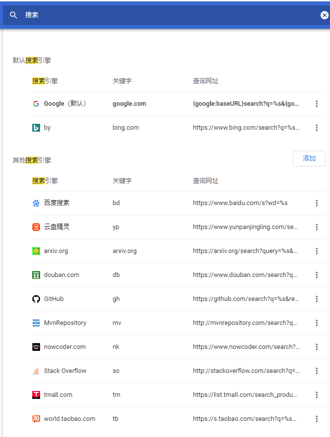

# chrome技巧

## 搜索引擎设置



## 搜索条件

1. intitle命令

   ```html
   关键词 intitle:标题上的关键词
   武侠小说 intitle:金庸
   ```

2. filetype

   ```html
   关键词 filetype:文件类型
   redis实战 filetype:pdf
   ```

3. 完全匹配搜索“ ”

   ```html
   "考研经验"       // 这个双引号是英文符号,使得搜索引擎分词失效
   ```

4. site命令

   ```html
   关键词 site:zhihu.com
   论文排版 site:zhihu.com
   PS site:52pojie.cn
   ```

5. 组合命令

   ```html
   intitle:"手机录屏软件" site:zhihu.com
   ```

6. 内容筛选`-`和`+`

   ```html
   关键词A -关键词B
   关键词A +关键词B
   
   李晨 -范冰冰
   李晨 +张馨予
   ```

7. 限定网站来源

   ```html
   intitle:"网络安全" gov filetype:pdf
   intitle:"北京房贷" gov filetype:pdf
   intitle:"软件演化" edu filetype:pdf
   ```

## 搜索黑科技

1. 微博关键词搜索
   1. 使用格式： **关键词 链接 密码**  或者 **关键词 链接 提取码**
   2. 示例：**国考 链接 密码** 或者 **国考 链接 提取码**
2. 网盘搜索引擎
   1. 搜索引擎：NCCKL、小白盘、盘多多、58网盘、去转盘网
3. 导航聚合类网站：龙轩导航、虫邮落快搜中、搜狗微信知乎、PPT优质网站与素材导航一hippterL 、沃喜导航、设计师导杭网站一优设导航、微信百宝精、**大数据导航**、B站
   1. 推荐使用：B站、大数据导航、优设导航、龙轩导航
4. 淘宝
   1. 使用格式：
   2. 使用示例：**公务员 课件**  
5. 应用商定
   1. 使用示例：**看病**

## 搜索电子书

## 油猴脚本

1. tampermonkey安装：谷歌插件商店
2. 油猴脚本下载网站：Greasy Fork
   1. 脚本推荐
      1. AC-baidu：重定向优化百度搜狗谷歌搜索_去广告_favicon_双列
      2. 豆瓣资源下载大师：1秒搞定豆瓣电影|音乐|图书下载
      3. 破解VIP会员视频集合。
      4. 自动翻页神器。
      5. searchEngineJump搜索引擎快捷跳转。
      6. 豆瓣资源下载大师。
      7. 购物党自动比价工具-领取淘宝内部券。
      8. Popup Search。