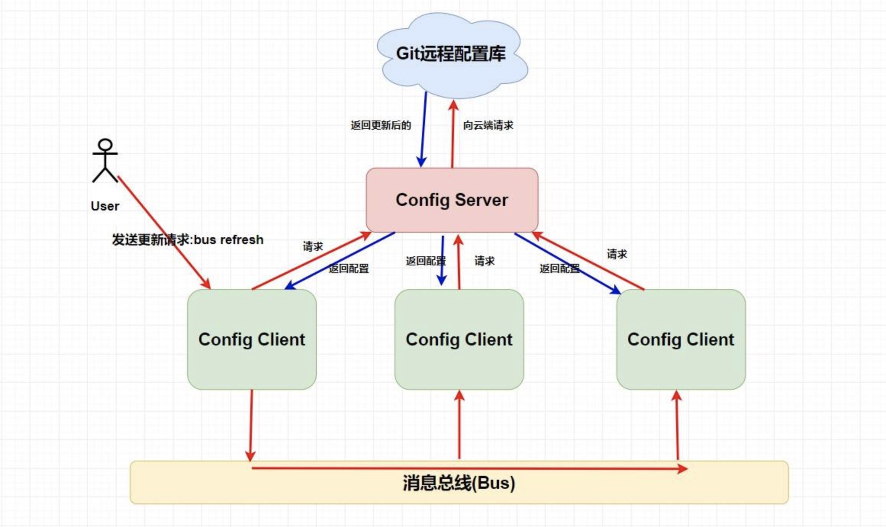

## 事务传播属性

1. requried：有加入，没有新建
2. supports：有加入，没有则非事务
3. mandatory：有加入，没有抛异常（他只能被一个父事务调用）
4. requried_new：新建事务，如果有则挂起当前
5. not_supported：非事务运行，有则挂起
6. never：非事务运行，有则抛异常
7. nested：有则嵌套内部（一个保存点），无则新建

## 循环依赖问题

#### Bean的初始化过程

1. **实例化Bean对象**（构造器循环依赖无法解决）
2. **设置对象属性**（Setter注入可以解决单例Bean循环依赖---因为有缓存，Prototype的循环依赖依旧无法解决， 因为不会放到缓存中，每次请求都会创造一个新的Bean）
3. 检查Aware相关接口并设置相关依赖
4. BeanPostProcessor
5. 检查是否InitializingBean已决定是否调用afterPropertiesSet方法
6. 检查是否配置有自定义的init-method
7. BeanPostProcessor后置处理
8. 注册必要的Destruction相关回调接口
9. 使用中
10. 是否实现DisposableBean接口
11. 是否配置有自定义的destroy方法

## Spring Cloud

1. Eureka
   1. 注册中心（Server）
   2. 服务提供者（Provide）
   3. 服务消费者（Consumer）
2. Ribbon
   1. 服务消费者使用，用来负载均衡
   2. Open Feign---简化调用
3. Hystrix
   1. 链式服务雪崩
   2. 熔断：断路器模式，服务B调用服务C在指定时间窗内，调用的失败率到达了一定的值，自动将B与C之间的请求都断开  **@HystrixCommand**
   3. 降级：方法调用异常，则返回另一种代码逻辑来给用户友好的回复  **@HystrixCommand(fallbackMethod = "getHystrixNews")**
      1. 热点新闻，访问过多，服务崩溃，系统降级---“给用户返回太多了请稍后提示”
      2. 问题：**如何判定什么时候发生异常？**
         1. 结合断路器
4. Zuul：消费者统一入口，
   1. 向Eureka注册：可以拿到消费者的元数据(名称，ip，端口)，便于**路由映射**，调用消费者的接口
   2. 路由功能
      1. 向Eureka注册获取消费者元数据
      2. 统一前缀
      3. **路由策略配置（对消费者采取自定义路由策略）**
      4. 服务器命屏蔽
      5. **路径屏蔽**
      6. 敏感消息头屏蔽
   3. 过滤器：限流、灰度发布、权限控制等等
      1. 过滤器类型
         1. Pre：在请求之前进行过滤
         2. Routing：`Routing`路由过滤器就是我们上面所讲的路由策略
         3. Post：在 `Response` 之前进行过滤的过滤器
      2. 自定义过滤器（继承ZuulFilter ）
         1. filterType 返回过滤器类型
         2. filterOrder 过滤优先级越小越先执行
         3. shouldFilter 过滤规则
         4. run 允许通过如何处理
   4. 令牌桶限流（结合过滤器）：首先我们会**有个桶**，如果里面没有满那么就会以一定 **固定的速率** 会往里面**放令牌**，一个请求过来首先要从桶中**获取令牌**，如果没有获取到，那么这个请求就拒绝，如果获取到那么就放行。
5. Spring Config
   1. **既能对配置文件统一地进行管理，又能在项目运行时动态修改配置文件**
   2. 配置漂移问题
      1. 解决方案：配合 Spring Cloud Bus进行动态配置更新

