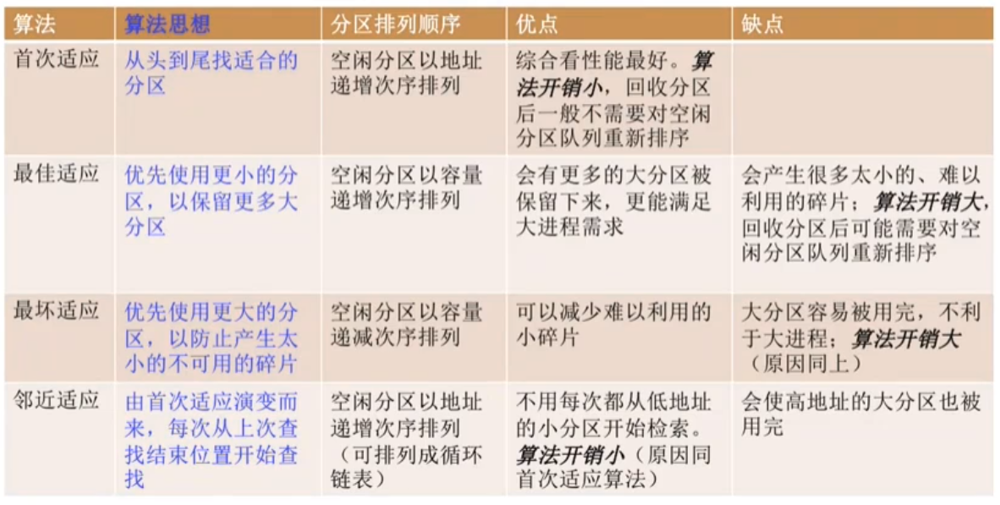
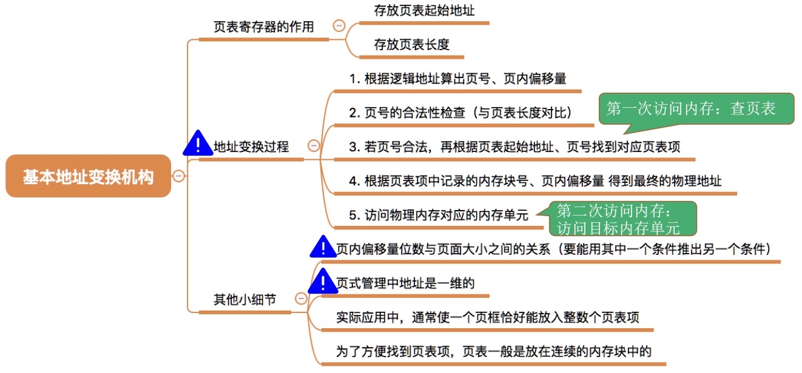
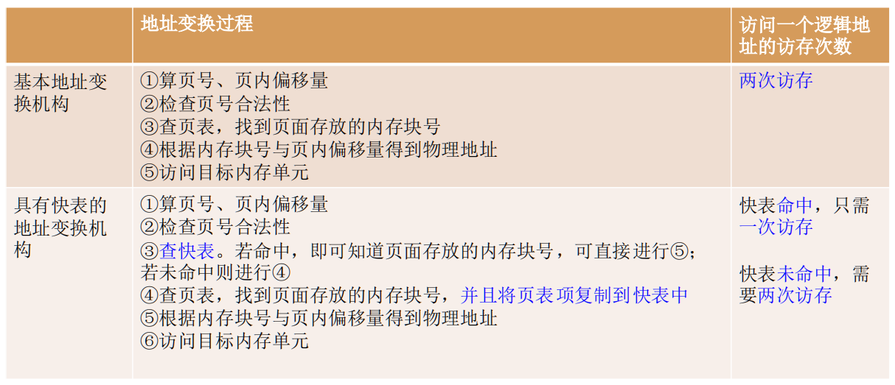
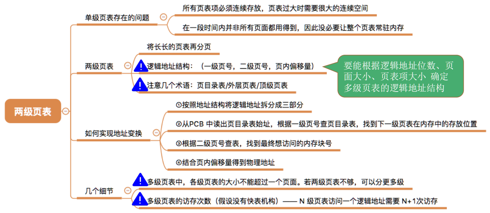
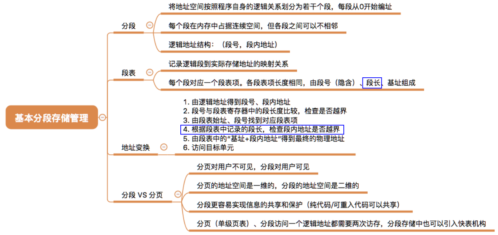
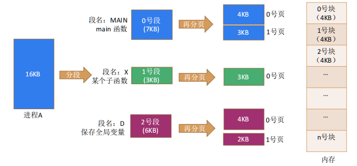
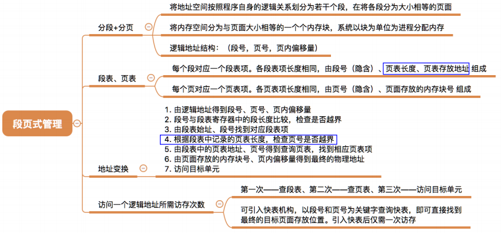

1. 进程通信的方式
   1. 管道
   2. 共享内存块
   3. 信号量
   4. 消息队列
   5. 套接字
   
2. 线程同步的方式
   1. 临界区
   2. 互斥量
   3. 信号量
   4. 事件
   
3. 协程的概念、优点

4. Linux的IO模型

   1. **同步模型（synchronous IO）**
   2. 阻塞IO（bloking IO）
   3. 非阻塞IO（non-blocking IO）
   4. 多路复用IO（multiplexing IO）
   5. 信号驱动式IO（signal-driven IO）
   6. **异步IO（asynchronous IO）**

   # 进程

   ## 进程调度算法

   1. 先来先服务
   2. 短作业优先
   3. 高优先权优先
      1. 优先权调度算法
         1. 抢占式
         2. 非抢占式
      2. 高响应比优先
   4. 基于时间片
      1. 时间片轮转
      2. 多级反馈队列

   # 连续分配

   ## 固定分区分配算法

   1. 分区大小相等
   2. 分区大小不等

## 动态分区分配算法

# 离散分配

## 基本分页式存储管理

1. 地址划分：【虚拟页号、页内地址】 ------> 【实页号、页内地址】

2. 变换机构：【越界中断】、【页表寄存器】、【页表】----> 【物理块号】

   

3. 快表：

   

   1. 为什么快表能加速找到页表项？

      1. 由于局部性原理，快表命中一般在90%以上
      2. 快表的速度比慢表一般快100倍

   2. 小问题

      1. 有些计算机设计，只能先查快表，不中的话，再查慢表（看具体的题目）
      2. 有些计算机设计，快表和慢表可以同时查询（看具体的题目）

      

4. 两级页表

   

## 基本分段存储管理

1. 分段地址结构：【段号、段内地址】
2. 段表：【段号】 ---->【段长、基址】
   1. 段表项长度
3. 分页、分段比较
   1. **分段比分页更容易实现信息的保护与共享**（生产者 消费者进程）
   2. **页**是信息的**物理单位**、**段**是信息的**逻辑单位**

## 分段和分页的对比

## 段页式存储管理

1. 总结

## 页面分配、置换策略

**固定分配局部置换**：系统为每个进程分配一定数量的物理块，在整个运行期间都不改变。若进程在运
行中发生**缺页**，则只能从该进程在内存中的页面中选出一页换出，然后再调入需要的页面。这种策略
的缺点是：很难在刚开始就确定应为每个进程分配多少个物理块才算合理。(采用这种策略的系统可
以根据进程大小、优先级、或是根据程序员给出的参数来确定为一一个进程分配的内存块数)
**可变分配全局置换**：刚开始会为每个进程分配一定 数量的物理块。操作系统会保持一个空闲物理块队
列。当某进程发生缺页时，从空闲物理块中取出一块分配给该进程；若已无空闲物理块，则可选择一
个**未锁定**的页面换出外存，再将该物理块分配给缺页的进程。采用这种策略时，只要某进程发生缺页，都将获得新的物理块，仅当空闲物理块用完时，系统才选择-一个未锁定的页面调出。被选择调出的页可能是系统中任何一个进程中的页，因此这个**被选中的进程拥有的物理块会减少，缺页率会增加。**
**可变分配局部置换**：刚开始会为每个进程分配一定数量的物理块。当某进程发生缺页时，只允许从该
进程自己的物理块中选出一个进行换出外存。如果进程在运行中**频繁地缺页**，系统会为该进程**多分配**
**几个物理块**，直至该进程缺页率趋势适当程度;反之，如果进程在运行中缺页率特别低，则可适当减
少分配给该进程的物理块。
**可变分配全局置换**：只要缺页就给分配新物理块
**可变分配局部置换**：要根据发生**缺页的频率**来动态地增加或减少进程的物理块

## 内存空间的扩充

1. 覆盖技术
2. 交换技术

虚拟存储器技术：交换技术为重要基础

## IO

## IO控制方式

CPU和IO之间的并行性不断提高

1. 程序控制方式：CPU轮询检查状态，**非并行**
2. 中断方式：以**字**为单位，CPU中断状态检查，**弱弱并行**
3. DMA方式：以**块**为单位，CPU传送一个（或多个）块之前和之后才会执行中断，**弱并行**
4. 通道控制方式：弱鸡版CPU，可以执行IO指令，CPU只需要在开始的时候发送好指令即可，**强并行**