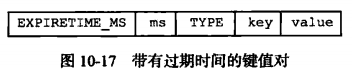
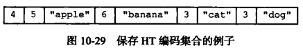
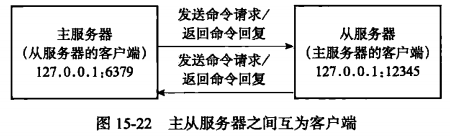

# 第一部分 数据结构与对象

## 第2章 简单动态字符串

1. SDS定义

2. SDS与字符串的区别
   1. 常数复杂度获取字符串长度
   2. 杜绝缓冲区溢出（若添加字符先检查空间是否充足，不足则扩容）
   3. **减少**修改字符串时带来的**内存重新分配次数**
      1. 空间预分配
      2. 惰性 空间释放策略 （也提供API手动释放）
   4. 二进制安全
   5. 兼容部分C字符串函数 （SDS的API在字符串末尾设置'\0'，保证一些C语言API可以重用）
3. 总结
   1. C字符串和SDS之间的区别
   2. SDS优点
      1. 常数复杂度获取字符串长度。
      2. 杜绝缓冲区溢出。
      3. 减少修改字符串长度时所需的内存重分配次数。
      4. 二进制安全。
      5. 兼容部分C字符串函数。

## 第3章 链表

1. 双向链表
2. 特性
   1. 双端
   2. 无环
   3. 带头指针和表尾指针
   4. 链表长度计数器
   5. 多态：链表可以用于保存不同类型的值

## 第4章 字典

### 1、字典的实现

1. 哈希表
   1. 哈希表结构定义：dictht
   2. 哈希表节点：dictEntry
   3. 字典：dict
      1. ht[0]
      2. ht[1]：rehash的时候使用

### 2、哈希算法

1. 计算哈希值：MurmurHash2算法
2. 索引值的方法：类似于HashMap的方法（ **hashcode & (len - 1)** ）

### 3、解决键冲突

1. 链地址法解决链冲突（头插法）

### 4、rehash（存放太多或者太少时）

1.  为字典的ht[1]哈希表分配空间
   1. 扩展
   2. 收缩
2. ht[0]转存到ht[1]
3. 释放ht[0]，而后指针转换ht[0] 设置为ht[1]，ht[1]设置为空白哈希表
   * 哈希表的扩展与收缩条件

### 5、渐进式rehash

1. 如果ht[0]存储太多的话 无法一下子搬运完成
2. 哈希表渐进式rehash的步骤：
   1. 为ht[1]分配空间
   2. 索引计数器变量rehashidx
   3. 每次对字典执行**添加**、**删除**、**查找**或者**更新**时，顺带将ht[0]上rehashidx索引上的键值对放到ht[1]
   4. 直到某一次，ht[0]所有键值对都放到ht[1]后`rehashidx = -1`表示完成rehash
      * 渐进式rehash执行期间的哈希表操作：
        * **查找**、**更新**、**删除**：**先在ht[0]**上操作，如果不存在就**在ht[1]**上操作
        * **添加**：**在ht[1]上**
3. 字典API

## 第5章 跳跃表

使用：**有序键集合**、集群节点中作为内部数据结构

1. 头结点
2. 为节点
3. 长度
4. 层
5. 后退指针：从后向前遍历的时候使用
6. 分值：按照分值**从小到大**排列，值可以相同，值相同按照字典序排序
7. 成员对象：唯一
8. 跨度：计算排位（rank）
9. zskiplist结构：持有表头节点、表尾节点、节点数量、层数最大的节点的层数

## 第6章 整数集合

是集合键的底层实现之一

1. 整数集合intset
   1. 编码方式
   2. 元素数量
   3. contents数组（元素类型由编码方式制定）：按值**从小到大**排序，无重复项
2. 升级：新加入元素的类型＞原类型 （O(N)）
   1. 扩展底层空间
   2. 转换元素为相同新类型
   3. 添加新元素
3. 升级好处：节约内存、灵活
4. 降级（不支持）

## 第7章 压缩列表

压缩列表( ziplist )是列表键和哈希键的底层实现之一。

**为什么能实现压缩**？

1. 节约内存、连续内存块顺序型数据结构
2. 结构
   1. 压缩列表的构成
   2. 压缩列表节点的构成
      1. previous_entry_length（1或5字节）：已知当前节点的指针，用以计算前一个节点的指针，从而实现**从后向前**遍历
      2. encoding：
      3. content：保存节点的值（节点类型长度由encoding属性决定）
3. 连锁更新（最坏O(N^2)）(一般来说最多会有几个进行连锁更新，出现几率不高)
   1. 添加节点时
   2. 删除节点时
4. 

## 第8章 对象

对象系统、引用计数计数的内存回收机制、引用技术节约内存、对象具有访问时间记录信息

### 1、对象类型与编码

1. 类型：字符串对、列表对象、哈希对象、集合对象、有序集合对象
   1. TYPE命令返回**值对象**类型
2. 对象编码
   1. OBJECT ENCODING命令可以查看数据库**值对象**的编码
3. 底层实现数据结构的指针

## 2、字符串对象

1. 编码方式：int、raw、embstr


2. 编码的转换
   1. 任何对embstr编码类型修改的命令都会将其转换为raw
3. 字符串命令的实现

## 3、列表对象

1. 编码方式：ziplist（压缩列表）、linkedlist（双端链表，不是双向）

2. 编码的转换
   1. ziplist
      1. 列表对象保存的所有字符串元素的长度都小于64字节;（可以修改上限）
      2. 列表对象保存的元素数量小于512个;不能满足这两个条件的列表对象需要使用linkedlist编码。（可以修改上限）
3. 列表命令的实现

## 4、哈希对象

1. 编码方式：ziplist（压缩列表）、hashtable

   1. ziplist

      

   2. hashtable

2. 编码的转换
   1. ziplist
      1. 哈希对象保存的所有键值对的键和值的字符串长度都小于64字节;（可以修改）
      2. 哈希对象保存的键值对数量小于512个;不能满足这两个条件的哈希对象需要使用hashtable编码。（可以修改）
3. 哈希命令的实现

## 5、集合对象

1. 编码方式：intset（压缩列表）、hashtable
   1. ziplist
   2. hashtable

2. 编码的转换
   1. intset
      1. 集合对象保存的所有元素都是整数值;
         集合对象保存的元素数量不超过512个。(可以修改)
3. 集合对象命令的实现

## 6、有序集合对象

1. 编码方式：ziplist、skiplist
2. ZSET的实现
   1. 结构体
      1. 跳跃表
      2. 
3. 编码的转换
   1. 转成ziplist
      1. 有序集合保存的元素数量小于128个; （可以修改）
      2. 有序集合保存的所有元素成员的长度都小于64字节;（可以修改）
4. 列表命令的实现

## 7、类型检查与命令多态

1. 类型检查的实现
2. 多态命令的实现
   1. 先检查编码而后应用命令


## 8、内存回收

1. 对象的引用计数信息会随着对象的使用状态而不断变化：

   1. 在创建一个新对象时，引用计数的值会被**初始化**为**1**

   2. 当对象**被一个新程序使用**时，它的引用计数值会被**增一**

   3. 当对象不再被一个程序使用时，它的引用计数值会被**减一**

   4. 当对象的引用计数值**变为0**时，对象所占用的内存会被**释放**

      

## 9、对象共享

1. 如果这时键B也要创建一个同样保存了整数值100的字符串对象作为值对象，那么服务器有以下两种做法：

   1. 为键B新创建一个包含整数值100的字符串对象

   2. **让键A和键B共享同一个字符串对象（数字型字符串）**（redis）

      **默认初始化0---9999（可以修改）**

      1. 将数据库键的值指针指向一个现有的值对象
      2. 将被共享的值对象的引用计数增一

2. **为什么Redis不共享包含字符串的对象：对象越复杂CPU时间消耗越多**

   1. 如果共享对象是保存整数值的字符串对象，那么验证操作的复杂度为0(1);
   2. 如果共享对象是保存宇符串值的字符串对象，那么验证操作的复杂度为O(N);
   3. 如果共享对象是包含了多个值(或者对象的)对象，比如列表对象或者哈希对
      象，那么验证操作的复杂度将会是O(N)。.

## 10、对象的空转时长

1. redisObject的LRU属性
   1. 记录了对象最后一次被命令程序访问的时间
   2. OBJECT IDLETIME命令
      1. 空转时长 = 当前时间 - LRU

# 第二部分 单机数据库的实现

## 第9章 数据库

### 1、服务器中的数据库

### 2、切换数据库

1. `select 2`  命令选择第二个数据库

### 3、数据库键空间

1. 添加新键
   1. 添加值--字符串
   2. 添加值--列表
   3. 添加值--哈希键值对
2. 删除键
3. 更新键
4. 对键取值

### 4、设置键的生存时间（过期时间）

1. 设置过期时间
   1. `expire 键名 时间秒`	
   2.  `expireat 键名 unix时间戳`
2. 保存过期时间
3. 移除过期时间
4. 计算并且返回剩余生存时间
5. 过期键的判定

### 5、==过期键的删除策略==

1. 定时删除（大量创建定时器**不现实**）
   1. 创建键时创建一个定时器，查找一个时间的复杂度是O(N)
   2. 优点：对内存友好
   3. 缺点：对CPU不友好，占用太多CPU时间，影响服务器响应时间和吞吐量
2. **惰性删除**
   1. 用时检查是否过期
   2. 优点：对CPU友好
   3. 缺点：对内存不友好，浪费过多内存，有**内存泄漏**的风险
3. **定期删除**
   1. 每隔一段时间对数据库进行检查删除里边的过期键，是定时删除与惰性删除两种方法的折中
   2. 难点是如何确定删除操作的 **时长**和 **频率**

### 6、==Redis过期键删除策略的实现==

1. 惰性删除策略的实现
   1. **expireIfNeeded函数**
2. 定期删除策略的实现（规定时间内从 `expire字典中`）
   1. **activeExpireCycle**函数每次运行时，都从一定数量的数据库中取出一定数量的随机键进行检查，并删除其中的过期键。
   2. 全局变量**current_ db** 会记录当前**activeExpireCycle函数**检查的进度，并
      在下一次**activeExpireCycle**函数调用时，接着上一次的进度进行处理。比如
      说，如果当前**activeExpireCycle**函数在遍历10号数据库时返回了，那么下
      次**activeExpireCycle**函数执行时，将从11号数据库开始查找并删除过期键。
   3. 随着**activeExpireCycle**函数的不断执行，服务器中的所有数据库都会被检
      查一遍，这时函数将**current_ db**变量重置为**0**，然后再次开始新一轮的检查
      工作。

#### 数据淘汰策略

在Redis中，允许用户设置最大使用内存大小server.maxmemory，当Redis 内存数据集大小上升到一定大小的时候，就会施行数据淘汰策略。
1.volatile-lru:从已设置过期的数据集中挑选最近最少使用的淘汰
2.volatile-ttr:从已设置过期的数据集中挑选将要过期的数据淘汰
3.volatile-random:从已设置过期的数据集中任意挑选数据淘汰
4.allkeys-lru:从数据集中挑选最近最少使用的数据淘汰
5.allkeys-random:从数据集中任意挑选数据淘汰
6.noenviction:禁止淘汰数据
redis淘汰数据时还会同步到aof

### ==6、AOF、RDB和复制功能对过期键的处理==

1. 生成RDB文件

   1. 会对键进行检查，已过期键不保存

2. 载入RDB文件

   1. 主服务器模式时：对文件里保存的键进行检查，过期键不载入
   2. 从服务器模式时：无论是否过期都载入（全部载入）

3. AOF文件写入

   1. 过期键**未被**惰性删除或者定期删除，则过期键无任何影响
   2. 过期键**被**惰性删除或者定期删除，向AOF文件追加（appen） **DEL命令**显示记录该键已被删除
   3. 例如：
      1. 从数据库中删除message键。
      2. 追加一条DEL message 命令到AOF文件。
      3. 向执行GET命令的客户端返回空回复。

4. AOF文件重写 （**重写**是什么意思？？）

   1. 重写时过期键不保存

5. 复制模式时（主服务器统一控制是否删除，保证主从服务器数据一致性）

   1. 主服务器在删除-个过期键之后，会显式地向所有从服务器发送一一个DEL命令,告知从服务器删除这个过期键。

   2. 从服务器在执行客户端发送的读命令时，即使碰到过期键也不会将过期键删除，
      是继续像处理未过期的键一样来处理过期键。

   3. 从服务器只有在接到主服务器发来的DEL命令之后，才会删除过期键。

   4. 例子：

      1. 访问从服务器的过期键

         ****

      2. 访问主服务器的过期键

         

### 7、数据库通知

“某个键执行了什么命令”：键空间通知

1. 发送通知
2. 发送通知的实现

## 第10章 RDB持久化

保存服务器的状态：每隔数据库及其在内存中蕴含的键值对

问题：如何开启RDB持久化、RDB持久化的追加是如何实现的（服务器的整个状态）？

### 1、RDB文件的创建与载入


1. 创建

   1. `SAVE`命令：SAVE命令会**阻塞Redis服务器进程**，直到RDB文件创建完毕为止，在服务器进程阻署期间，服务器不能处理任何命令请求:
   2. `BGSAVE`命令：
      1. 子进程：创建一个子进程，并且由子进程负责创建RDB文件，完成后向父进程发送信号（子进程会复制父进程的所有数据，因此内存占用翻倍）
      2. 父进程：继续处理命令请求，并通过轮询等待子进程的信号

2. 载入：服务器启动时自动执行载入RDB文件（如果文件存在的话）

   

3. `SAVE`命令执行时的服务器状态：服务器阻塞，拒绝所有命令请求，等SAVE执行完后才能接受命令请求并且处理

4. `BGSAVE`命令执行时的服务器状态：子进程进行保存RDB文件，Redis服务器仍然可以处理请求

   1. `BGSAVE`执行时 `SAVE`会被拒绝，以防止竞争
   2. `BGREWRITEAOF`和`BGSAVE`两个命令**不能同时执行：**
      1. 如果`BGSAVE`命令正在执行，那么客户端发送的`BGREWRITEAOF`命令会被**延迟**到`BGSAVE`命令执行完毕之后执行。
      2. 如果`BGREWRITEAOF`命令正在执行，那么客户端发送的`BGSAVE`命令会被服务器**拒绝**。

5. RDB文件载入时服务器的状态：服务器阻塞，直至载入完成

### 2、自动间隔性保存

1. 设置保存条件

   1. 使用命令主动设置：`save  间隔时间段  修改次数` 

      1. 例如：`save 60 10000`：即服务器在60秒之内，对数据库修改至少10000次时执行`BGSAVE`

   2. 默认：

      ```redis
      save 900 1
      save 300 10 
      save 60 1 0000
      ```

2. **dirty计数器和lastsave属性**

   1. dirty计数器：dirty计数器记录距离上一次成功执行SAVE命令或者BGSAVE命令之后，服务器对数据库状态(服务器中的所有数据库)进行了多少次修改(包括写人、删除、更新等操作)。
   2. lastsave属性：是一个UNIX时间戳，记录了服务器上一次成功执行SAVE命令或
      者BGSAVE命令的时间。

3. **检查**保存条件是否满足

   1. 函数serverCron默认每隔100毫秒就会执行一次，检查**save选项**设置的条件是否满足（遍历条件）
      1. 遍历所有条件
      2. 计算距离上次执行保存键还有多少秒
      3. 如果数据库状态的修改次数超过条件所设置的次数，并且距离上次保存的时间超过条件所设置的时间，那么执行保存操作

### 3、RDB文件结构（第六版）


* REDIS：5个字符 'R','E','D','I','S'
* db_version：RDB文件版本号
* databases：
* EOF：数据结束符
* check_sum：载入数据的校验和，在载入时会进行比较，查看是否文件出错或者损坏

1. databases部分

   

2. key_value_pairs部分

   

   

3. value编码

   1. 字符串对象

      1. `REDIS_ENCODING_INT`编码 
      2. `REDIS_ENCODING_RAW`
         1. 字符串压缩

   2. 列表对象 `REDIS_ENCODING_LIST`

      

      列表长度、列表项（列表项长度，列表项）

   3. 集合对象 `REDIS_ENCODING_SET`

      

   4. 哈希表对象`REDIS_ENCODING_HASH`

      

      

      哈希键值对数量、键值对（Key长度，Key，Value长度，Value）、...

   5. 有序集合对象`REDIS_ENCODING_ZSET`

      

      有序集合元素数量、集合元素（元素长度、元素、分值长度、分值字符串）、...

   6. INTSET编码集合对象`REDIS_ENCODING_INTSET`

      1. 保存：整数转换成字符串保存
      2. 载入：字符串转成整数载入

   7. ZIPLIST编码的列表、哈希表或者有序集合

      1. `REDIS_RDB_TYPE_LIST_ZIPLIST`、`REDIS_RDB_TYPE_HASH_ZIPLIST`、`REDIS_RDB_TYPE_ZSET_ZIPLIST`、

### 4、分析RDB文件

1. 不包含任何键值对的RDB文件
2. 包含字符串键的RDB文件
3. 包含带有过期时间的字符串键的RDB文件
4. 包含一个集合键的RDB文件

## 第11章 AOF持久化

### 1、AOF持久化的实现

#### AOF_BUF、AOF持久化策略

1. 命令追加

2. AOF文件的写入与同步

   1. **appendfsync**值产生不同的持久化行为

      

      1. 总是，将`aof_buf`缓冲区中的所有内容写人并同步到`AOP`文件

      2. 距离上次写入超过一秒时，同步写入AOF操作由一个线程专门负责

      3. 不同步写，什么时候写由操作系统决定

         

   2. **AOF持久化的效率和安全性：由appendfsync值决定采用什么同步策略而影响效率和安全性**

### 2、AOF文件的载入与数据还原


### 3、AOF重写

AOF膨胀，命令冗余，创建一个新的AOF文件剔除冗余命令

1. **AOF文件重写的实现**

   原理：直接读取数据库中的键值对，直接形成命令，这样一条命令即可保存一个键值对

   **重写什么时候发生？**

   **重写过程：**

   1. 创建新AOF文件
   2. 遍历数据库
      1. 忽略空数据库
      2. 遍历数据库中的所有键
         1. 忽略已过期的键
         2. 根据键的类型对键进行重写
         3. 如果键带有过期时间，过期时间也要被重写

   **rewrite_string函数**

   1. GET命令获取字符串键的值
   2. SET命令重写字符串键

   ···其他函数略

   例子：AOF重写后的文件

   

   **客户端输入缓冲区溢出问题：**元素数量最大值，大于则该成多条命令

   例如：

2. **AOF后台重写**

   1. Redis单线程处理请求命令

   2. 子进程进行AOF重写

      1. 子进程进行AOF重写期间，服务器进程(父进程)可以继续处理命令请求。
      2. 子进程带有服务器进程的数据副本，使用子进程而不是线程，可以在避免使用锁的情况下，保证数据的安全性。

      **可能出现的问题：**

      1. 子进程写入时，父进程依旧接受命令进行数据库的处理，这样会造成数据不一致

      解决方案：

      1. 为了解决这种数据不一致问题，Redis 服务器设置了一个**AOF重写缓冲区,**这个缓冲区在服务器创建子进程之后开始使用，当Redis服务器执行完一个写命令之后，它会同时将这个写命令发送给**AOF缓冲区**和**AOF重写缓冲区**

         

      2. AOF重写完成后，追加AOF缓冲区里的命令到新AOF文件

### 一般是同时开启RDB和AOF

1. 服务器启动时的加载：先加载AOF

### ==AOF和RDB同时工作==

（1）如果RDB在执行snapshotting操作，那么redis不会执行AOF rewrite; 如果redis再执行AOF rewrite，那么就不会执行RDB snapshotting

（2）如果RDB在执行snapshotting，此时用户执行BGREWRITEAOF命令，那么等RDB快照生成之后，才会去执行AOF rewrite

（3）同时有RDB snapshot文件和AOF日志文件，那么**redis重启的时候**，会优先使用AOF进行数据恢复，因为其中的日志更完整

## 第14章 服务器

### 1、命令请求的执行过程

1. 发送命令请求
2. 读取命令请求
3. 命令执行器(1):查找命令实现（字母大小写不影响命令）
4. 命令执行器(2);执行预备操作
   1. cmd指针指向不为空
   2. 检查参数个数
   3. 身份验证检查
   4. ...
5. 命令执行器(3):调用命令的实现函数
6. 命令执行器(4):执行后续工作
7. 将命令回复发送给客户端
8. 客户端接收并打印命令回复

### 2、serverCron函数

## 第15章 复制

### 1、旧版复制功能的实现

1. 同步

   1. SYN命令步骤：

      

   2. 主从服务器同步过程例子

2. 命令传播

   

   

   

   

### 2、旧版复制功能的缺陷

1. 从服务器对主服务器的复制情况分为：
   1. 初次复制
   2. 断线后重复制（完全复制RDB，因此十分低效）：SYNC命令十分消耗资源

### 3、新版复制功能的实现

1. PSYNC命令代替SYNC命令
   1. 完整重同步（初次复制情况）
   2. 部分重同步（断线后重复制情况）

### 4、==部分重同步的实现==

1. 复制偏移量（主、从都有）

   

   

   

2. ==复制积压缓冲区==

   

   1. 复制积压缓冲区构造
   2. 从服务器重连时的操作：
   3. 根据需要调整复制积压缓冲区的大小

3. 服务器运行ID（随机生成）

   1. 初次复制：从服务器传送ID给主

### 5、==PSYNC命令的实现==


### 6、==复制的实现==

1. 步骤1 :设置主服务器的地址和端口

2. 步骤2 :建立套接字连接

   

   

3. 步骤3:发送PING命令（检查是否双方状态正常），三种情况：

   1. 主对从发，从未回复，网络状态不佳，断开当前连接，从服务器重连

   2. 主服务器返回一个错误，主服务器忙，从服务器断开重连

   3. 从服务器接到“PONG”，状态正常，执行复制

      

4. 步骤4:身份验证

   

5. 步骤5:发送端口信息

   

6. 步骤6:同步

   1. PSYNC完整重同步（主是从的客户端）

   2. PSYNC部分重同步（主是从的客户端）

      

7. 步骤7:命令传播

### 7、心跳检测

1. 检测主从服务器的网络连接状态

2. 辅助实现min-slaves配置选项

3. 检测命令丢失

   1. 主服务器主动发送 `replconf ack`命令

   2. 检测双方复制偏移量是否一致，不一致说明发生丢失

      

## 第16章 Sentinel


### 1、启动并初始化Sentinel

1. 初始化服务器（Seninel不使用数据库，所以无需载入RDB和AOF）

   

2. 使用Sentinel专用代码

   1. 有些普通redis的命令未载入
   2. 载入了Sentinel的专用命令

3. 初始化Sentinel状态

4. 初始化Sentinel状态的masters属性

   1. masters字典

5. 创建连向主服务器的网络连接

   1. Sentinel成为主服务器的客户端

      1. 命令连接

      2. 订阅连接

         

         

### 2、获取主服务器信息


### 3、获取从服务器信息


### 4、向主服务器和从服务器发送信息

命令格式：


### 5、接收来自主服务器和从服务器的频道信息


1. 更新sentinels字典

2. 创建连向其他Sentinel的命令连接

   **Sentinel之间不会创建订阅连接**

   

### 6、检测主观下线状态

1. ping命令（与它创建命令连接）

2. 回复情况：

   1. 有效回复：实例返回+PONG、-L0ADING、-MASTERDOWN三种回复的其中一种。
   2. 无效回复：无回复 或者 除+PONG、-L0ADING、-MASTERDOWN外的回复

   

   

### 7、检查客观下线状态

​		当**Sentinel将一个主服务器判断为主观下线**之后，为了确认这个主服务器是否真的下线
了，它会向同样**监视这一主服务器的其他Sentinel进行询问**，看它们是否也认为主服务器已
经进入了下线状态(可以是主观下线或者客观下线)。当Sentinel从其他Sentinel那里接收到足够数量的已下线判断之后，Sentinel 就会将从服务器判定为客观下线，并对主服务器执行故障转移操作。

1. **源Sentinel发送**SENTINEL is-master-down-by-addr命令

   1. 询问其他Sentinel是否同意主服务器已下线

2. **目标Sentinel接收**SENTINEL is-master-down-by-addr命令

3. **源Sentinel接收**SENTINEL is-master-down-by-addr命令的**回复**

   

   

### 8、选举领头Sentinel

​		当一个主服务器被判断为客观下线时，监视这个下线主服务器的各个Sentinel会进行协商，选举出一个领头Sentinel,并由领头Sentinel对下线主服务器执行故障转移操作。

​	一个redis服务被判断为客观下线时，多个监视该服务的sentinel协商，选举一个领头sentinel，对该redis服务进行故障转移操作。**选举领头sentinel遵循以下规则：**

1. 所有的sentinel都有**公平被选举**成领头的资格。
2. 所有的sentinel都有且**只有一次**将某个sentinel选举成领头的机会（在一轮选举中），一旦选举某个sentinel为领头，不能更改。
3. sentinel设置领头sentinel是**先到先得**，一旦当前sentinel设置了领头sentinel，以后要求设置sentinel为领头请求都会被拒绝。
4. 每个发现服务客观下线的sentinel，都会要求其他sentinel将自己设置成领头。
5. 当一个sentinel（源sentinel）向另一个sentinel（目sentinel）发送is-master-down-by-addr ip port current_epoch runid命令的时候，runid参数不是*，而是sentinel运行id，就表示源sentinel要求目标sentinel选举其为领头。
6. 源sentinel会检查目标sentinel对其要求设置成领头的回复，如果回复的leader_runid和leader_epoch为源sentinel，表示目标sentinel同意将源sentinel设置成领头。
7. 如果某个sentinel被半数以上的sentinel设置成领头，那么该sentinel既为领头。
8. 如果在限定时间内，没有选举出领头sentinel，暂定一段时间，再选举。

### 9、故障转移（领头Sentinel进行）

1. 选出新的主服务器

   1. 列表过滤
      1. 删除下线、断线
      2. 删除5秒内未回复INFO命令的
      3. 删除所有与已下线主服务器连接断开超过down-a fter- mi1l i seconds
         10毫秒的从服务器: down-after-milliseconds 选项指定了判断主服务器下线所需的时间
      4. 按照服务器优先级进行排序选取优先级大的
         1. 如果优先级相同则选择offset偏移量大的
            1. 如果偏移量相同，则选择运行ID最小的从服务器
   2. Sentinel发送`salve no one`给选取出来的从服务器，并且使用`INFO`监听其role，是否变为了`master`

2. 修改从服务器的复制目标

   1. Sentinel使用 `slaveof`命令将从服务器重新变成**新主服务器**的**从服务器**

   

   

3. 将旧的主服务器变为从服务器

   1. Sentinel使用 `slaveof`命令将**原来的主服务器**变成**新主服务器**的**从服务器**

   

## 第17章 集群

### 1、节点

命令：`cluster meet <ip> <port>`

加入某个集群过程：


1. 启动节点

   

2. 集群数据结构

   1. clusterNode结构（记录连接到此节点的其他节点状态）
   2. clusterLink结构（连接到某节点的连接信息）
   3. clusterState结构（每个节点都有一个、保存集群信息）

3. cluster meet 命令的实现

### 2、槽指派

1. 槽概念

   1. 槽数量：0---16384
   2. 集群上线状态判定（与槽有关）：16384个槽**全都**被处理，就算只有一个未被处理也是没上线状态
   3. 指派槽命令：`cluster addslots <slot>  [slot.....]` 
      1. 例如：`cluster addslots 0 1 2 3 4 ... 5000`

2. 记录节点的槽指派信息

   

   

3. 传播节点的槽指派信息

   

   **集群中的每个节点都会知道数据库中的16384个槽分别被指派给了集群中的哪些节点**

4. CLUSTER ADDSLOTS命令的实现

### 3、在集群中执行命令

1. 计算键属于哪个槽
2. 判断槽是否由当前节点负责处理
3. MOVED 错误
4. 节点数据库的实现

### 4、

### 5、

### 6、

### 7、

### 8、

## 第22章 二进制位数组

### 1、位数组表示

### 2、GETBIT命令实现

### 3、SETBIT命令实现

1. 两种方式
   1. 按书写方式保存（**不好**会造成移位）
   2. 按逆序保存位数组（很好，无需移位）

### 4、BITCOUNT命令实现

1. 遍历算法（不好，效率十分低）
2. 查表算法（八位长的位数组为键，value是值）（效率比上一个算法提升了八倍）
3. variable-precision SWAR算法
4. Redis的实现
   1. 查表算法 + variable-precision SWAR算法
      1. 每次调入128个二进制位，调用4次SWAR算法
      2. 小于128位，查表
      3. 大于128位SWAR
5. 疑惑：**为什么不使用一个变量来记录里边1的数量呢？**
   1. 可能需要范围查询，即：某个区间范围内有多少个**1**

### 5、BITOP命令实现

