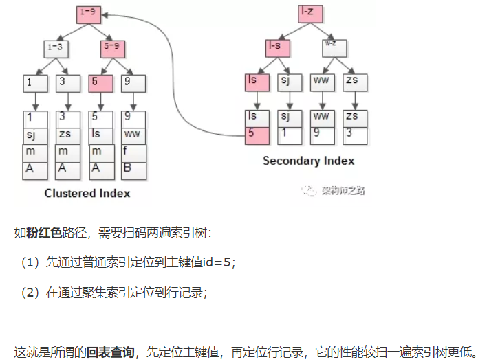
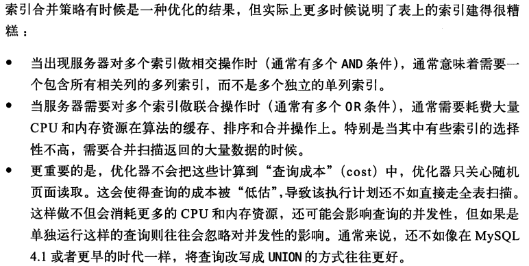
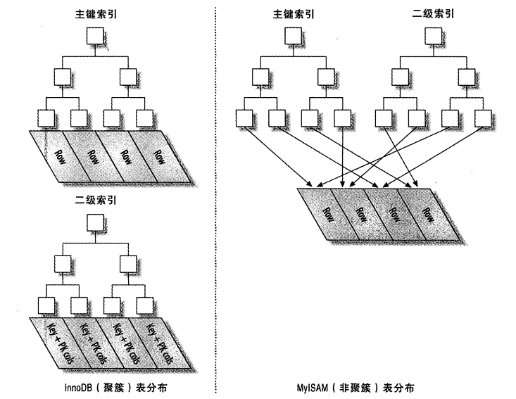

回表查询



# 第五章 创建高性能的索引

## 索引基础

### 覆盖索引

### B+树索引

1. 支持部分索引匹配
2. 值在叶子结点
3. 值顺序排列、顺序IO、排序方便

### 哈希索引

1. 只支持等值比较查询：=、in()、<=>

2. value存指针，还需要读表

3. 不支持排序

4. 不支持部分索引匹配查找

5. 不支持范围查询

6. 冲突多维护代价大（删除某个数据时需要遍历链表）

   适合：查找表

**innodb引擎：自适应哈希索引** 

#### 创建自定义哈希索引

思路很简单：在B-Tree基础上创建一个伪哈希索引。这和真正的哈希索引不是一回事,
因为还是使用B-Tree进行查找，但是它使用哈希值而不是键本身进行索引查找。你需要
做的就是在查询的WHERE子句中手动指定使用哈希函数,**url_crc是自定义列**。

```sql
mysql> SELECT id FROM url WHERE url="http://www.mysq1.com";
mysql> SELECT id FROM url WHERE url="http://ww.mysq1. com"
		->AND url_ crc=CRC32("http://www.mysq1.com");

```

**处理哈希冲突**（有同样的hash值时，必须有其常量值作为区分，否则会查出多个）


**维护哈希值**

可以使用触发器在插入和更新时维护url_crc列

### 空间数据索引

## 索引的优点

1. 索引大大减少了服务器需要扫描的数据量。
2. 索引可以帮助服务器避免排序和临时表。
3. 索引可以将随机I/O变为顺序I/O.

三星系统

### 索引是最好的解决方案吗？

不是，当维护索引的开销大于其得到的优化时反而拖累系统，比如：小的表，全表查询还很快

## 高性能索引策略

### 1、独立的列

“独立的列”的含义：索引列不能是表达式的一部分，也不能是函数的参数

错误的做法：

```sql
mysql> SELECT actor_ id FROM sakila.actor WHERE actor_id+1=5;
mysql> SELECT ... HERE TO_ DAYS(CURRENT. DATE) - T0_ DAYS(date_ col) <= 10;
```

### 2、前缀索引和索引选择性

前缀索引：长字符串建立的索引很大占用空间，索引一个长字符串的前边一小部分

索引选择性：**不重复的索引值**(也称为基数，cardinality)和**数据表的记录总数**(#T) 的**比值**，范围从1/#T到1之间。索引的选择性。越高则查询效率越高，因为选择性高的索引可以让MySQL在查找时过滤掉更多的行。**唯一索引的选择性是1**,这是**最好**的索引选择性，性能也是最好的。

创建的前缀索引应该接近于完整列的“基数”

#### 计算合适的前缀长度

计算完整列的选择性

计算不同前缀长度的选择性

#### 前缀索引的缺点

Mysql无法使用前缀索引做ORDER BY 和 GROUP BY、覆盖扫描

#### 后缀索引

邮件后缀，判定某个域名的电子邮件地址，反向字符串在存储可以利用前缀索引

### 3、多列索引

```sql
早期版本的Mysql会使用全表扫描，即使建立了索引
mysq1> SELECT film id, actor_ id FROM sakila .film_ actor
		-> WHERE actor_id=10Rfi1m_id= 1;

UNION可以使用索引
mysql> SELECT film_ id, actor_ id FROM sakila.film_ actor WHERE actor_ id = 1
-> UNION ALL
-> SELECT film_ id, actor_ id FROM sakila.film actor WHERE film id = 1
->AND actor_ id < 1;

```

Mysql5.0 之后已经有了优化，可以使用索引扫描的联合（索引合并）（多个独立的单列索引）

**索引合并有时候不好**



### 4、选择合适的索引列顺序

多列索引的列顺序至关重要

1. 经验法则
   1. 将选择性最高的列放到索引的最前列
      * 有时候不是最好的，排序啥的都做不了
   2. 考虑全局基数和选择性
      * 当使用前缀索引的时候，在某些条件值的基数比正常值高的时候，问题就来了,会使得该查询十分的慢

### ==5、聚簇索引==

聚簇索引性**并不是**一种单独的**索引类型**，而**是一种数据存储方式**

当表有聚簇索引时,它的数据行实际上存放在索引的叶子页(leaf page)中

1. 聚簇
   1. 表示数据行和相邻键值紧凑的存储到一起，且无法同时把数据行存放在两个不同的地方，因此一个表只能有一个聚簇索引（Mysql不支持选择某个索引作为聚簇索引，Mysql中主键列作为聚簇索引）
2. 优点
   1. 数据聚集减少IO
   2. 数据访问更快，因为把索引和数据保存在同一个B-Tree里
   3. 使用覆盖索引扫描的查询可以直接使用页节点中的主键值
3. 缺点
   1. 数据放内存中就无优势了
   2. 插入速度严重依赖于插入顺序
   3. 更新聚簇索引的代价很高
   4. 基于聚簇索引的表在插入新行，或者主键被更新导致需要移动行的时候，可能面临
      “页分裂(page split)”的问题。
   5. 聚簇索引可能导致全表扫描变慢，尤其是行比较稀疏，或者由于页分裂导致数据存
      储不连续的时候。
   6. 二级索引(非聚簇索引)可能比想象的要更大，因为在二级索引的叶子节点包含了
      引用行的主键列。
   7. 二级索引访问需要两次索引查找，而不是一次。

#### InnoDB和MyISAM的数据分布对比

1. MyISAM数据分布
   1. 按照插入顺序存储在磁盘上
2. Innodb的数据分布



#### 在InnoDB表中按主键顺序插入行

1. 最好使用自动增长的主键
2. 如果使用随机的键值，可能会引起极大的性能问题：
   1. 目标页可能从cache中移除了
   2. 乱序写引起页分裂
   3. 频繁的页分裂页变得稀疏不规则，有碎片


### ==6、覆盖索引==

​		如果索引的叶子节点中已经包含要查询的数据，那么还有什么必要再**回表查询**呢?如果一个索引包含(或者说覆盖)所有需要查询的字段的值，我们就称;之为“覆盖索引”。

覆盖索引的支持

​		不是所有类型的索引都可以成为覆盖索引。覆盖索引必须要存储索引列的值，而哈希索
引、空间索引和全文索引等都不存储索引列的值，所以MySQL只能使用B-Tree索引做
覆盖索引。另外，不同的存储引擎实现覆盖索引的方式也不同，而且不是所有的引擎都
支持覆盖索引(在写作本书时，Memory 存储引擎就不支持覆盖索引)。.

### 7、使用索引扫描来做排序