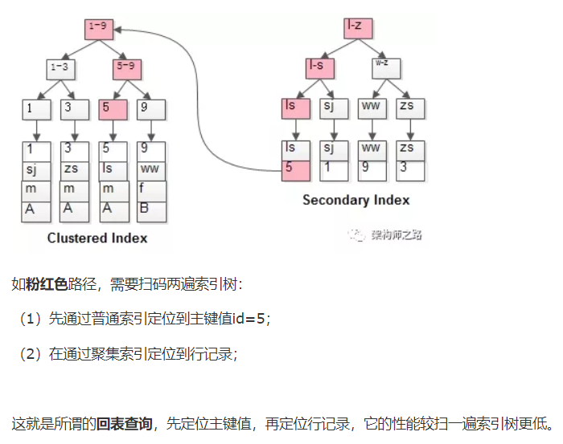

### Mysql

1. 概念性

   1. 解释MySQL外连接、内连接与自连接的区别
   2. 完整性约束包括哪些？
   3. 关系型数据库三范式
   4. 请简洁描述Mysql中InnoDB支持的四种事务隔离级别名称，以及逐级之间的区别？

4. 引擎

   1. myisam和innodb的区别
   2. innodb引擎深度解析

3. 语句

   1. drop,delete与truncate的区别
   2. 查询优化：explain，慢查询，show profile

4. 局部性原理与磁盘预读

5. 数据结构

   1. 在Mysql中ENUM的用法是什么？
   2. CHAR和VARCHAR的区别？

6. 锁

   1. 行锁，表锁，页级锁，意向锁，读锁，写锁，悲观锁，乐观锁等等
   2. 锁的优化策略
   3. 乐观锁和悲观锁是什么，INNODB的标准行级锁有哪2种，解释其含义。
   4. mysql innodb 什么时候使用表锁 
      1. 事务更新大部分或全部数据（由于事务与两段锁协议），导致很慢
      2. 设计多个表，比较复杂，可能引起死锁

7. 索引
   1. 索引合并（多个单独的索引列）
   2. 多列索引（联合索引）、最左前缀匹配原则
   3. 聚集索引和非聚集索引
      1. 什么叫做回表
   4. **覆盖索引**
   5. 为什么不用二叉树作为索引
   6. B树、B+树对比，为什么用B+树作为索引
   7. Hash索引和B+树索引对比
   8. 一个B+树的节点中到底存多少个元素最合适你有了解过么？
   9. InnoDB引擎主键为什么设成自增（B+树，插入最后否则插入中间页分裂等问题）
   10. 索引失效条件
   
11. 什么情况下不宜建立索引？（对于经常插入，修改和删除数据的表，不宜创建过多的索引。  对于数据量比较小的表，不必创建索引。）
   
8. 日志

   1. 三日志：binlog、redo log、undo log
   2. 事务是如何通过日志来实现的，说得越深入越好
   3. 主从复制原理

9. 如何使用一致性视图实现MVCC？

10. 写一个多表查询题目

11. 分布式：分库分表，读写分离

12. 主从复制

    1. 主从复制原理
    2. MYSQL的主从延迟怎么解决
    
    

回表查询

### EXPLAIN 技巧

做 MySQL 优化，我们要善用 EXPLAIN 查看 SQL 执行计划。

下面来个简单的示例，标注（1、2、3、4、5）我们要重点关注的数据：

- **type 列，**连接类型。一个好的 SQL 语句至少要达到 range 级别。杜绝出现 all 级别。 
- **key 列，**使用到的索引名。如果没有选择索引，值是 NULL。可以采取强制索引方式。 
- **key_len 列，**索引长度。 
- **rows 列，**扫描行数。该值是个预估值。 
- **extra 列，**详细说明。注意，常见的不太友好的值，如下：Using filesort，Using temporary。

### MyISAM和innodb的区别:

1. InnoDB **支持事务**，MyISAM **不支持事务**。这是 MySQL 将默认存储引擎从 MyISAM 变成 InnoDB 的重要原因之一；

2. InnoDB **支持外键**，而 MyISAM **不支持**。对一个包含外键的 InnoDB 表转为 MYISAM 会失败；  

3. InnoDB 是**聚集索引**，MyISAM 是**非聚集索引**。聚簇索引的文件存放在主键索引的叶子节点上，因此 InnoDB 必须要有主键，通过主键索引效率很高。但是辅助索引需要两次查询，先查询到主键，然后再通过主键查询到数据。因此，主键不应该过大，因为主键太大，其他索引也都会很大。而 MyISAM 是非聚集索引，数据文件是分离的，索引保存的是数据文件的指针。主键索引和辅助索引是独立的。 

4. InnoDB **不保存表的具体行数**，执行 select count(*) from table 时需要全表扫描。而**MyISAM 用一个变量保存了整个表的行数**，执行上述语句时只需要读出该变量即可，速度很快；    

5. InnoDB 最小的锁粒度是**行锁，**MyISAM 最小的锁粒度是**表锁**。一个更新语句会锁住整张表，导致其他查询和更新都会被阻塞，因此并发访问受限。这也是 MySQL 将默认存储引擎从 MyISAM 变成 InnoDB 的重要原因之一；

**如何选择：**

1. 是否要支持事务，如果要请选择 InnoDB，如果不需要可以考虑 MyISAM；

2. 如果表中绝大多数都只是读查询，可以考虑 MyISAM，如果既有读写也挺频繁，请使用InnoDB。

3. 系统奔溃后，MyISAM恢复起来更困难，能否接受，不能接受就选 InnoDB；

4. MySQL5.5版本开始Innodb已经成为Mysql的默认引擎(之前是MyISAM)，说明其优势是有目共睹的。如果你不知道用什么存储引擎，那就用InnoDB，至少不会差。