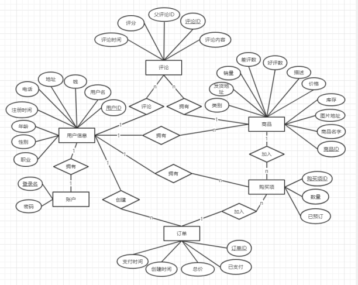

# 项目-Myshop

### 技术

SpringBoot、SpringMVC、Mybatis、Mysql、Redis、RabbitMQ

### 数据库

#### 表设计

### SQL代码

1. 

### 代码架构

1. 前端
   1. vue、vue-router、

### 项目细节

1. @CrossOrigin
2. 功能
   1. 用户：
      1. 注册
         1. 发送注册消息
         2. 处理注册消息
      2. 登录
         1. 发送登录消息
            1. 账号、密码、验证码（redis：uid_login、超时时间）
         2. 处理登录消息
            1. redis-个人信息、Session
      3. 注销
         1. Redis删除Session
   2. 用户个人信息模块
      1. 查询个人信息
         1. 发送查询个人信息消息
         2. 处理查询个人信息消息
      2. 修改个人信息
         1. 发送修改的个人消息
         2. 处理修改的个人消息
   3. 订单管理模块
      1. 未支付
         1. 发送支付消息
         2. 处理支付消息
      2. 已支付
         1. 用户查询订单信息
   4. 商品信息查询
   5. 

#### Key生成策略