# 查看路径

**which 命令**，查找可执行文件

```shell
which nginx
```

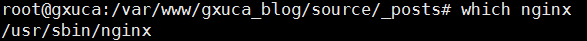 


**whereis 命令**， 查找

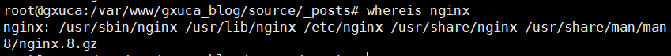


# 文件及目录管理

## 创建和删除

- 创建：mkdir
- 删除：rm
- 删除非空目录：rm -rf file目录
- 删除日志 rm *log (等价: $find ./ -name “*log” -exec rm {} ;)
- 移动：mv
- 复制：cp (复制目录：cp -r )


给每项文件前面增加一个id编号(看上去更加整洁):

```shell
ls | cat -n
```

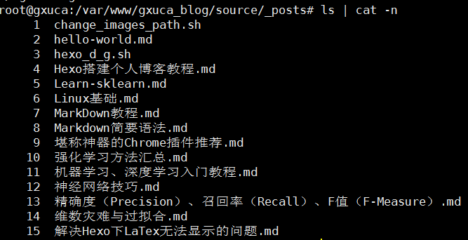

## 目录切换

- 显示当前路径: pwd

- 切换到上一级目录：cd ..

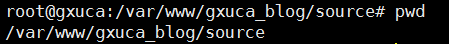

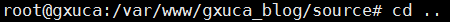

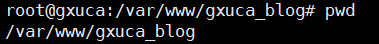

- 切换到上一个工作目录： cd -


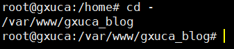

- 切换到root目录： cd or cd ~

  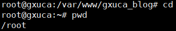

- 跳到指定的目录：cd path

例子，跳到指定的目录：

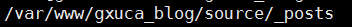

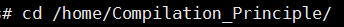

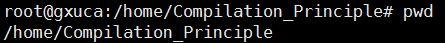

## 列出目录项

```shell
ls -a
```

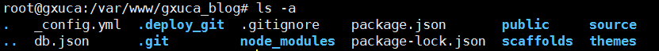

```shell
ls -l
```

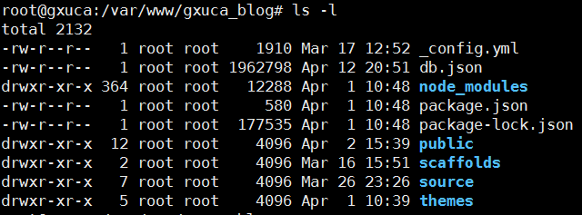

文件按照时间排序：

```shell
ls -lrt
```

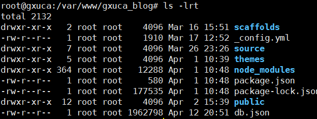

由于'ls -l' 和 'ls -lrt' 的使用频率非常高，我们给其设置一个命令别名：

**(如果不会使用vim，就先不弄)**

```
# 这个是用vim 打开.bashrc配置文件
vim ~/.bashrc   
```

```shell
# 随便在某行添加以下，然后保存文件并离开':wq'
alias ll='ls -alF'
alias la='ls -A'
alias l='ls -CF'
alias lsl='ls -lrt'
alias lm='ls -al|more'
```

```shell
# 配置文件激活(更改了配置，激活了才生效)
source ~/.bashrc
```

看看效果：

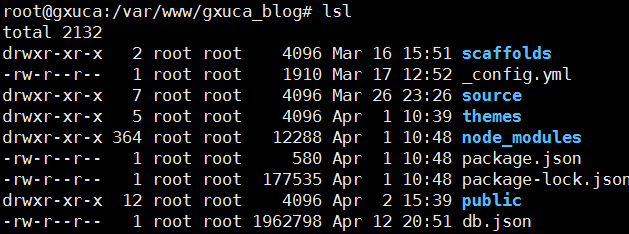

## 查找目录及文件：find/locate 命令

### find:


**在某个路径下查找文件或目录：**

```shell
# filename 里边可以使用正则表达式
# 当path为：./ 时，在当前目录下查找
find path -name "filename"
```

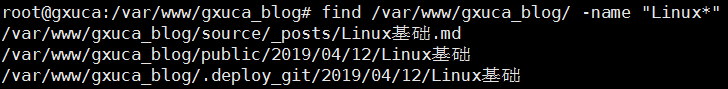

**按关键字查找：**

```shell
find ./ -name "Hexo*"
```

其它一些常用参数：

```shell
# 按照文件所属的组来查找
find ./ -group "jkingkong"

# 按照文件的所属的用户来查
find ./ -user "jkingkong"

# -atime n  查找系统中最后n*24小时访问的文件
# -amin n   查找系统中最后N分钟访问的文件
# -mmin n   查找系统中最后N分钟被改变文件数据的文件
# -mtime n  查找系统中最后n*24小时被改变文件数据的文件
find ./ -atime 2 "*rc"
```


### locate:

find是实时查找，如果需要更快的查询，可试试locate；locate会为文件系统建立索引数据库，如果有文件更新，需要定期执行更新命令来更新索引库。


### grep

```shell
cat Linux基础.md | grep -E "gh|^as"
```


  

chmod -R a+rw *
数字权限使用格式
在这种使用方式中，首先我们需要了解数字如何表示权限。 首先，我们规定 数字 4 、2 和 1表示读、写、执行权限（具体原因可见下节权限详解内容），即 r=4，w=2，x=1 。此时其他的权限组合也可以用其他的八进制数字表示出来，如： rwx = 4 + 2 + 1 = 7 rw = 4 + 2 = 6 rx = 4 +1 = 5 即

若要同时设置 rwx (可读写运行） 权限则将该权限位 设置 为 4 + 2 + 1 = 7 若要同时设置 rw- （可读写不可运行）权限则将该权限位 设置 为 4 + 2 = 6 若要同时设置 r-x （可读可运行不可写）权限则将该权限位 设置 为 4 +1 = 5

上面我们提到，每个文件都可以针对三个粒度，设置不同的rwx(读写执行)权限。即我们可以用用三个8进制数字分别表示 拥有者 、群组 、其它组( u、 g 、o)的权限详情，并用chmod直接加三个8进制数字的方式直接改变文件权限。语法格式为 ：
--------------------- 
作者：林20 
来源：CSDN 
原文：https://blog.csdn.net/u013197629/article/details/73608613 
版权声明：本文为博主原创文章，转载请附上博文链接！


```shell
# 打包和压缩是不同的概念，
# 打包：是将所有文件变成一个文件，且其大小不变
# 压缩：运用压缩算法，将打包好的文件的大小尽可能缩小
打包：tar cvf FileName.tar DirName
(例： tar cvf log.tar a.log )
解包：tar xvf FileName.tar
(例： tar xvf log.tar)

压缩：tar zcvf FileName.tar.gz DirName
（例子： tar zcvf log.tar.gz a.log  # 将a.log 压缩成 log.tar.gz 保留源文件）
解压：tar zxvf FileName.tar.gz
(例子：tar zxvf log.tar.gz    # 直接解压出a.log)

解压2：gunzip log.tar.gz ( #将log.tar.gz 变成log.tar,不保留源文件 log.tar.gz )

```


