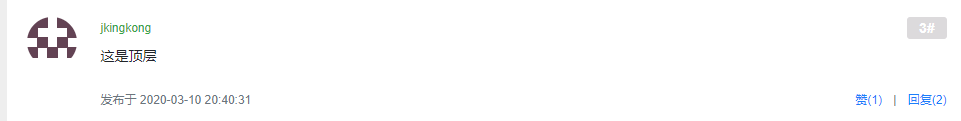
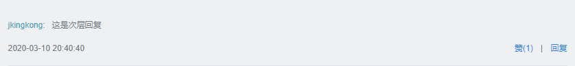
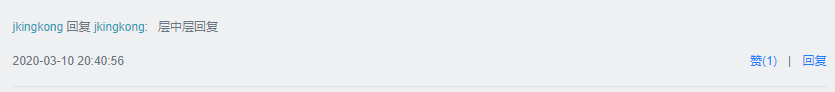

# 功能目录  

1. 首页、显示前10个帖子

2. 登录模块

   1. 注册：邮件认证
   2. 登录：验证码、Cookie、Session（自定义注解，并利用拦截带有自定义注解的方法，再检查访问该方法时用户的登录状态，从而判定用户的访问权限）
   3. 登出
   4. 账号设置：上传头像、获取头像

3. 核心功能

   1. **过滤敏感词**
   2. 发布帖子
   3. 帖子详情
   4. 添加评论
   5. 显示评论
   6. 发送私信
   7. 私信列表
   8. 私信详情
   9. **统一异常处理**
   10. **统一记录业务日志**

4. Redis

   1. 点赞
   2. 我收到的赞
   3. 关注、取关
   4. 关注数（粉丝数）
   5. 关注列表（粉丝列表）
   6. 优化登录模块

5. KafKa消息队列

   1. Kafka入门、整合

   2. **社区通知功能**

      1. 处理评论事件

      2. 处理点赞事件

      3. 处理关注事件

         （即：在收到评论时、点赞时、关注时，通过发布系统消息对用户进行通知）

6.  Elasticsearch，分布式搜索引擎

   1. Elasticsearch入门、整合
   2. **社区搜索功能**

7. 项目进阶

   1. Spring Security入门
   2. 权限控制
   3. 置顶、加精、删除
   4. Redis高级数据类型
   5. 网站数据统计
   6. 任务执行和调度
   7. 热帖排行
   8.  生成长图
   9. 将文件上传至云服务器
   10. 优化网站的性能

8. 项目发布与总结

   1. 单元测试
   2. 项目部署
   3. **项目监控**
   4. 项目总结

# 详细实现

## 数据库设计

1. 表

   1. **user表**

      1. id、header_url、create_time、username
      2. password、salt（MD5加密的盐）、email（注册邮箱）
      3. status（0-未激活; 1-已激活;）、activation_code（激活码注册后要在邮箱里点击激活链接）
      4. type（0-普通用户; 1-超级管理员; 2-版主   用来权限控制）

   2. **discuss_post表（帖子表）**

      1. id、create_time 
      2. user_id   是谁创建了表
      3. title、content  （标题、内容）
      4. type   （0-普通; 1-置顶;）
      5. status ( 0-正常; 1-精华; 2-拉黑; )
      6. comment_count  （顶层评论数量）
      7. score（热帖排行用的分数）

   3. **comment  （评论表）**

      1. id （该条评论的id）、create_time（帖子创建时间）

      2. user_id （谁发的）、content （内容）

      3. **entity_type** （1-给帖子的顶层评论； 2-评论的回复 ）

      4. **entity_id** （帖子id   或者  评论id）

      5. **target_id**  （0-表示回复顶层评论，非0表示被回复人的id）

      6. status （不知道是干啥的）

         * **entity_type 、entity_id 、target_id  三个配合的可能**：

           1. 表示顶层评论：entity_type 为1、entity_id 为帖子id、target_id 为0 

              

           2. 表示回复顶层：entity_type 为2、entity_id为评论id、target_id 为0

              

           3. 表示层中A回复B：entity_type 为2、entity_id为评论id、target_id 为用户id

              

   4. **login_ticket表：(保存token的表)**

      1. id    
      2. user_id  （表示哪个用户）
      3. ticket （token ）
      4. status (0-有效; 1-无效;)
      5. expired （过期时间）

   5. **message表**

      1. id （消息id）
      2. from_id（谁发的）
         1. from_id 为 `1`表示评论  或者 赞
         2. from_id 为其他表示私信
      3. to_id（发给谁）
      4. **conversation_id** 
         1. **"from_id" +"_" + "to_id"**   表示某人给某人发的私信（会话ID）
            1. 规定：111->112 和 112->111公用同一个id：111_112 (小id在前) 
         2. **like** 表示收到一个赞
         3. **comment**  表示一个评论
         4. **follow**  表示跟帖
      5. content （消息内容）
         1. 纯文本
         2. **{"entityType":1,"entityId":271,"postId":271,"userId":138}**
      6. status（0-未读;1-已读;2-删除;）
      7. create_time (创建时间)

### 静态资源引用

1. thymeleaf模板的语法@{}

### 项目调试技巧

### 版本控制

### 首页

1. 帖子列表（10个）
2. 分页操作

### 日志

1. 配置日志的设置
2. 配置AOP
   1. 通知 （前置通知记录访问情况，【ip，时间，访问了什么】）
   2. 连接点
   3. 切点（监控service）
   4. 切面
   5. 引入
   6. 织入
   7. 切入点

### 验证码

### 邮件服务

邮件注册账号与激活

#### 

1. 首页、显示前10个帖子

2. 登录模块

   1. 注册：邮件认证
   2. 登录：验证码、Cookie、Session（自定义注解，并利用拦截带有自定义注解的方法，再检查访问该方法时用户的登录状态，从而判定用户的访问权限）
      1. 
   3. 登出
   4. 账号设置：上传头像、获取头像

3. 核心功能

   1. **过滤敏感词**
   2. 发布帖子
   3. 帖子详情
   4. 添加评论
   5. 显示评论
   6. 发送私信
   7. 私信列表
   8. 私信详情
   9. **统一异常处理**
   10. **统一记录业务日志**

4. Redis

   1. 点赞
   2. 我收到的赞
   3. 关注、取关
   4. 关注数（粉丝数）
   5. 关注列表（粉丝列表）
   6. 优化登录模块

5. KafKa消息队列

   1. Kafka入门、整合

   2. **社区通知功能**

      1. 处理评论事件

      2. 处理点赞事件

      3. 处理关注事件

         （即：在收到评论时、点赞时、关注时，通过发布系统消息对用户进行通知）

6.  Elasticsearch，分布式搜索引擎

   1. Elasticsearch入门、整合
   2. **社区搜索功能**

7. 项目进阶

   1. Spring Security入门
   2. 权限控制
   3. 置顶、加精、删除
   4. Redis高级数据类型
   5. 网站数据统计
   6. 任务执行和调度
   7. 热帖排行
   8.  生成长图
   9. 将文件上传至云服务器
   10. 优化网站的性能

8. 项目发布与总结

   1. 单元测试
   2. 项目部署
   3. **项目监控**
   4. 项目总结